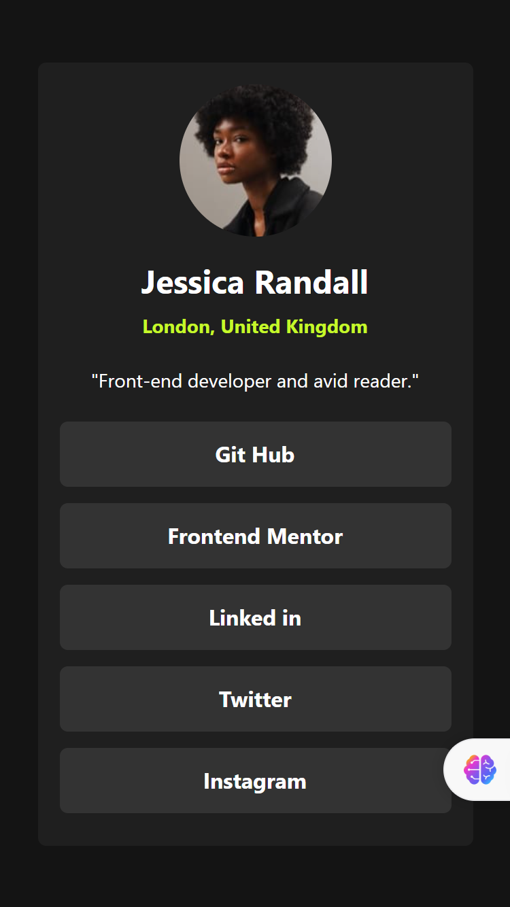

# Frontend Mentor - Social links profile solution

This is a solution to the [Social links profile challenge on Frontend Mentor](https://www.frontendmentor.io/challenges/social-links-profile-UG32l9m6dQ). Frontend Mentor challenges help you improve your coding skills by building realistic projects. 

## Table of contents

  - [Overview](#overview)
  - [Screenshot](#screenshot)
  - [Links](#links)
  - [My process](#my-process)
  - [Built with](#built-with)
  - [What I learned](#what-i-learned)
  - [Continued development](#continued-development)
  - [Author](#author)

## Overview
  Project Name: Social Link Profile Solutions.
  Project Description: This is a Project given To me by my Coach at Hertech trail cohort 10 webdev pro to explore in the documentation of Tailwind css.
  Features: A profile site where users are able to See hover and focus states for all interactive elements on the page

### Screenshot




### Links

- Solution URL: [Add solution URL here](https://your-solution-url.com)
- Live Site URL: [Add live site URL here](https://your-live-site-url.com)

## My process
- i started with downloading Node JS on my Pc
- Then the installation of Tailwind css on this folder
- Created/Customized my colors, Heights, and Media query responsive widths on tailwind.config.Js file
- I did  my styling and wrote my content on Index.html

### Built with

- Semantic HTML5 markup
- Tailwind CSS
- Flexbox
- CSS Grid
- Node Js

### What I learned

While Working through this project using Tailwind CSS rather than the normal process of styling it has significantly changed my approach to styling, by directly applying classes with multiple value to HTML elements, I've been able to create layouts and styles with minimal CSS overrides.

for example: 
```html
<h1 class=" bg-black text-center w-10 h-10">Some HTML code I'm proud of</h1>🎉
🎉

### Continued development

Use this section to outline areas that you want to continue focusing on in future projects. These could be concepts you're still not completely comfortable with or techniques you found useful that you want to refine and perfect.

**Note: Delete this note and the content within this section and replace with your own plans for continued development.**

## Author

- Website - [Aboyi Blessing Ennah](https://www.your-site.com)
- Frontend Mentor - [@yourusername](https://www.frontendmentor.io/profile/yourusername)
- Twitter - [@yourusername](https://www.twitter.com/yourusername)